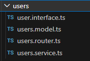
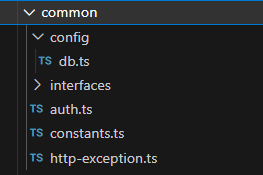
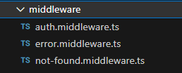
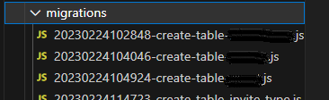

# Backend

## File Structure

<br />

The backend follows the old MVC pattern but since this is a backend service, instead of _Views_, that layer is replaced with _Routes_. Like:

```
Route > Service > Model
```

Our common practice to segregate the files is to group them by entity.
In case of _users_, all files relating to users are contained in a _users_ folder.



Tools that can be utilized from any part of the codebase, like database library, are stored within the _common_ folder.




<br />

## Middlewares

<br />



We use middlewares mainly for error handling and authentication.  
One of our most critical requirements is restricting routes by user access levels. That means not all routes are accessible by any user types.
One example is implementing an `adminOnly` middleware:

```ts
export function adminOnly(
  req: UserAuthRequest,
  res: Response,
  next: NextFunction
) {
  jwt.verify(token, process.env.JWT_SECRET as string, (err: any, user: any) => {
    // other validations

    user.isAdmin = [ROLES.superAdmin, ROLES.churchAdmin].includes(user.roleId);

    if (!user.isAdmin) {
      return res.sendStatus(401);
    }

    next();
  });
}
```

Here, you can see that the user is considered an admin if they fall under _superAdmin_ or _churchAdmin_ user types.  
This middleware will then applied to routes that are allowed only for admins:

```ts
// DELETE /api/users/:id
router.delete(
  "/:id",
  [authenticate, adminOnly],
  async (req: any, res: Response) => {
    // delete user
  }
);
```

<br />

## Migrations

<br />



Database migration is an effective way to manage changes to a database schema over time. We choose to use migrations because it helps maintain database consistency. Additionally, since we tend to switch machines frequently, having migrations ensures that the changes to the schema are tracked and can be applied on any machine. Using migrations is also beneficial in the long run, especially if we ever have co-developers to join the team, as it helps keep our databases in sync.

We use the `db-migrate` package to create, deploy and rollback migrations.
We added the most used commands in our package.json:

```json
 "scripts": {
   ...
    "migrate": "db-migrate up",
    "migrate:rollback": "db-migrate down",
    "migrate:create": "db-migrate create",
  },
```

<br />

---
