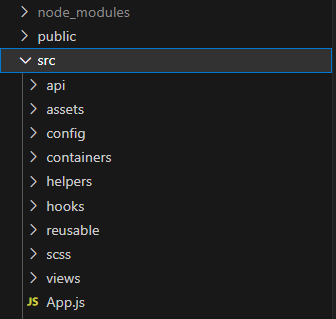

# Frontend

## File Structure

<br />

The frontend files structure is organized according to usage. Specifically, there are folders for: components (views), hooks, api calls, and helper functions.



<br />

## State Management

<br />

Our project does not utilize state management libraries like Redux or Zustand. Instead, we make use of React's Context APIs to manage state. We follow the principle of colocating state, where state is defined close to where it is used.

```js
const initialState = {
  data: [],
  filter: {},
};

const reducer = (state, action) => {
  switch (action.type) {
    case "SET_DATA":
      return { ...state, data: action.payload };
    case "SET_FILTER":
      return { ...state, filter: action.payload };
    default:
      return state;
  }
};

export const useAttendanceContextProvider = ({ eventId = 0 }) => {
  const [state, dispatch] = useReducer(reducer, initialState);
  const { filter } = state;

  const fetchData = useCallback(async () => {
    const response = await apiCall();
    const results = response ? response : [];
    const dataArray = [];
    // compose array
    dispatch({ type: "SET_DATA", payload: dataArray });
  }, [eventId, filter]);

  useEffect(() => {
    fetchData();
  }, [fetchData]);

  const setFilter = (filter) => {
    dispatch({ type: "SET_FILTER", payload: filter });
  };

  return {
    ...state,
    fetchData,
    setFilter,
    eventId,
  };
};
```

In this example, we expose state and functions to manage attendance records for an event. It consists of:

- An initial state object containing empty data and filter objects
- A reducer function to update the state based on actions
- A context provider function that:
  - Initializes state and dispatch from useReducer
  - Executes an API call to fetch attendance data and update state accordingly
  - Calls the API call on mount using a useEffect hook
  - Exposes a setFilter function to update the filter state
  - Exports state, API call, setFilter, and eventId

By creating this context, we can:

- Fetch attendance data in a single place
- Share the data and functions with consumer components
- Ensure consistent state management
- Easily update the API call logic in one place without changing consumers

<br />

## Hooks

<br />

In this project, we use hooks for further separation of concerns, abstraction and code reuse.

```js
export const useAuth = () => {
  const [auth, setAuth] = useState({});

  useEffect(() => {
    const dataFetch = async () => {
      const [data] = await Promise.all([checkLogin()]);
      setAuth(data);
    };

    dataFetch();

    return () => {
      setAuth({});
    };
  }, []);

  return { auth };
};
```

This is a custom React Hook called useAuth. It contains some authentication logic:

- It uses useState to maintain an auth state object
- On mount (empty dependency array in useEffect), it fetches authentication data using checkLogin()
- It sets the auth state to the data returned from checkLogin()
- On unmount, it clears the auth state
- It returns the auth state object, which consumer components can use

For example, a consumer component can do:

```js
// consumer
const { auth } = useAuth();
const isAdmin = auth.isAdmin;
```

In situations where multiple components need authentication data, it's useful to abstract that logic into a custom hook and share the auth state between components via the hook.

<br />

### React Query

<br />

We utilize another custom hook called _useQuery_ from the `react-query` library. The useQuery hook allows you to easily fetch data from an API endpoint and manage the resulting data, loading state, and errors. It also provides advanced features such as caching, polling, and automatic refetching.

```js
const useGetMembers = (params) => {
  const queryString = encodeQueryData(params);
  const { isLoading, isError, data, error, refetch } = useQuery(
    [
      "getMembers",
      // params
    ],
    () => getMembers(queryString),
    {
      staleTime: 5000,
    }
  );

  return {
    isLoading,
    isError,
    data,
    error,
    refetch,
  };
};

// usage
const { isLoading, data, refetch } = useGetMembers(filter);
```

The useQuery hook takes three arguments:

1. An array that serves as a cache key for the query. In this case, the cache key is an array with a single string element "getMembers". If the params object changes, the cache key will be updated automatically, which will trigger a new API call.

2. A function that returns the data to be fetched. In this case, the getMembers function is called with the encoded query string as an argument.

3. An options object for the query. In this case, setting the staleTime option to 5000 milliseconds means that the cached data will be considered fresh for 5 seconds. After that, if the data is requested again, React Query will automatically trigger a background update to fetch fresh data.

<br />

---