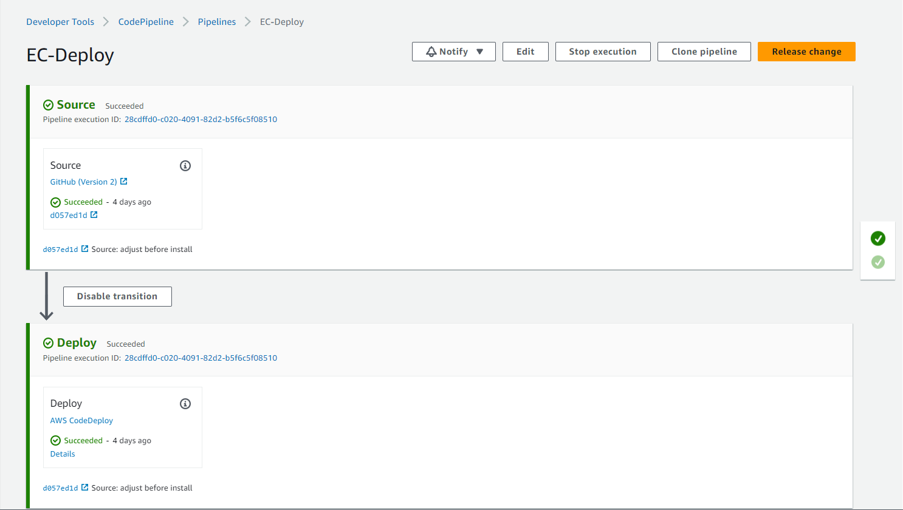
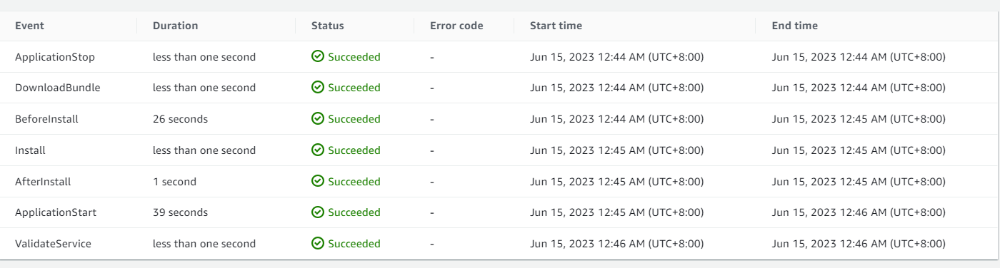

# Deployment

## Codebase

Our two codebases for the frontend and backend follow a consistent branching strategy that comprises three branches: dev, staging, and main. The _main_ branch is where the production code lives.

<br />

## Continuous Integration/Delivery

Our CI/CD framework is built by putting some AWS components together including `CodePipeline`, `DeploymentGroups` and `CodeDeploy`.

CodePipeline orchestrates the whole deployment process through defined _Stages_:



1. Source Stage\
   When we push changes to our GitHub repo, this stage is triggered. This happens thanks to `AWS CodeStar` connection, which sets up a webhook behind the scenes to listen for these changes. That latest version of the codebase is then bundled into a build file called _Artifact_ then passes it to the next stage.

2. Deploy Stage\
   This is where the actual deployment happens. In this stage, CodeDeploy takes over and reads the input artifact, then executes the build hooks specified in the `appspec.yml` file, if it is present in the root folder. This includes running the _BeforeInstall_ hook, which prepares the environment for the latest code version, the _AfterInstall_ hook, which performs additional setup tasks, and the _AppStart_ hook, which starts the application. CodeDeploy knows which EC2 instance/s it should deploy to because we set those instances in a Deployment Group and we assigned it to this stage.

`appspec.yml`

```yml
version: 0.0
os: linux
files:
  - source: /
    destination: /var/www/html/my-app
hooks:
  BeforeInstall:
    - location: scripts/before_install.sh
      timeout: 300
  AfterInstall:
    - location: scripts/after_install.sh
      timeout: 300
  ApplicationStart:
    - location: scripts/application_start.sh
      timeout: 300
```

`before_install.sh`

```yml
#!/bin/bash

# clean up
sudo apt-get purge nodejs npm
# add repository
curl -sL https://deb.nodesource.com/setup_16.x | sudo bash -
# install both nodejs & npm
sudo apt-get update
sudo apt install awscli -y
sudo apt-get install nodejs -y
sudo apt-get install jq -y

# Install pm2 module
# https://www.npmjs.com/package/pm2
sudo npm install pm2 -g
```

`after_install.sh`

```yml
#!/bin/bash

PARAMATER="MYENV"
REGION="ap-southeast-1"
WEB_DIR="/var/www/html/my-app"
WEB_USER="ubuntu"

cd $WEB_DIR
# set permission to create file
sudo chown $WEB_USER. .env

# Get parameters and put it into .env file inside application root
aws ssm get-parameter --with-decryption --name $PARAMATER --region $REGION | jq -r '.Parameter.Value' > $WEB_DIR/.env
```

`application_start.sh`

```yml
#!/bin/bash

cd /var/www/html/my-app

sudo npm install
sudo npm run build
sudo npm run migrate

# Stop all servers and start the server as a daemon
sudo pm2 delete all
npm run pm2
```

<br />

These hooks are automatically translated and then executed by CodePipeline like so:



<br />

## Networking

For our web server to be accessible through our custom domain, we configured our DNS Settings to point the domain to the Elastic IP address of the instance by creating an _A Record_.

Then we configured `Apache` to listen to the requests sent to the domain. If we configured a `VirtualHost` for our domain, Apache will know where it should redirect our request. In this case, our instance that hosts the web server.

We just followed this [generic](https://www.digitalocean.com/community/tutorials/how-to-install-the-apache-web-server-on-ubuntu-22-04) approach to make this work.

Also this [guideline](https://www.digitalocean.com/community/tutorials/how-to-secure-apache-with-let-s-encrypt-on-ubuntu-22-04) shares how to apply an SSL certificate to our domain using `Certbot` to allow HTTPS connection.

<br />

## Future Plans

While we currently have limited demands on our resources, we have proactively identified areas for improvement in anticipation of potential future demand. These include:

* Implementing an Auto-Scaling Group to automate the process of adding or removing instances based on demand.
* Utilizing an Elastic Load Balancer to handle redirection to instances, thus eliminating the need for Apache.
* Exploring the use of Kubernetes as a flexible and scalable container orchestration solution, which also provides flexible monitoring capabilities.

By preparing for these potential changes now, we hope to ensure that our system can handle increased demand in the future while maintaining optimal performance and minimizing resource usage.
